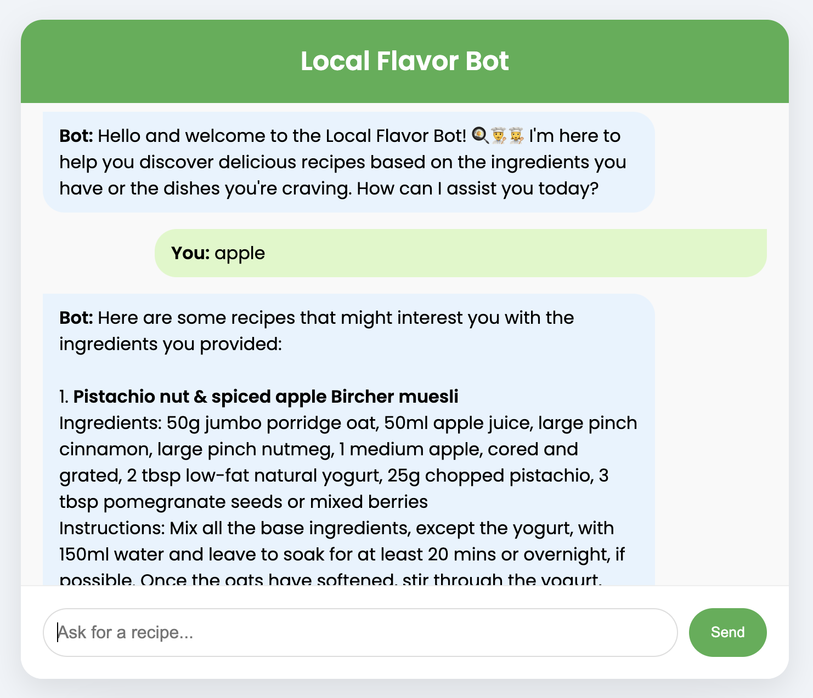

# Flavor Bot

Flavor Bot is a recipe recommendation chatbot that suggests recipes based on ingredients or dish preferences.

## Live Demo

You can try out the live version of the Local Flavor Bot here: https://flavorbot.akgns.com/

## User Interface




## Getting Started

These instructions will help you set up and run the project on your local machine.

### Prerequisites

- Python 3.7+
- pip (Python package manager)
- Docker (optional)

### Installation

#### Using Virtual Environment

1. Clone the repository: `git clone https://github.com/ckakgun/flavor-bot.git`
 
    `cd flavor-bot`

2. Create and activate a virtual environment: 
     * `python -m venv` 
     * `venv source venv/bin/activate` 
    >  On Windows, use `venv\Scripts\activate`


3. Install the required packages: `pip install -r requirements.txt`

4. Run the application: `python recipe_finder.py`

5. The application should now be running on `http://localhost:5000`.

#### Using Docker
1) Build flavor-bot : `docker build -t flavor-bot:latest -f docker/Dockerfile .`
2) Run image : `docker run -p 5000:5000 -it flavor-bot`
   
#### Requirements
The main requirements for this project are:

- Flask,
- NLTK,
- scikit-learn

You can download NLTK stopwords by running if you don't have it already:

```python
import nltk
nltk.download('stopwords')
```

For a complete list of dependencies, please refer to the [requirements.txt](requirements.txt) file.

### Contributing
Contributions are welcome! Please feel free to submit a pull request.
