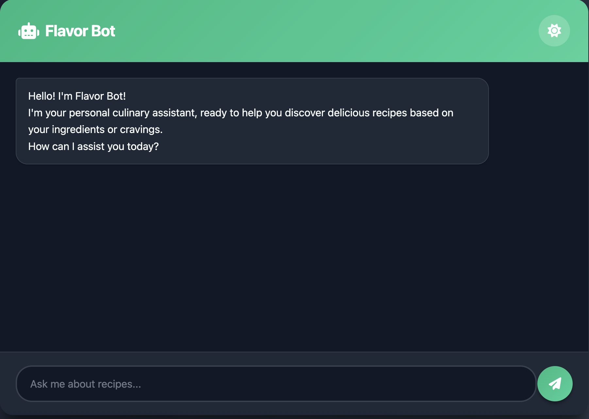

# Local Flavor Bot 🍳

Local Flavor Bot is a recipe recommendation chatbot that suggests recipes based on ingredients or dish preferences. The bot uses the Spoonacular API for recipe data and implements semantic search for better results.

## Features and Live Demo
You can try out the live version of the Local Flavor Bot here: https://flavorbot.akgns.com/

## Screenshots
### Web Interface


### Recipe Search Results


### CLI Interface


## Features
- Web UI for easy search
- CLI interface for command-line use
- Semantic search using transformer models
- Rate limiting to prevent API abuse
- Detailed recipe information including:
    - Time
    - Servings
    - Ingredients list
    - Instructions
    - Source URL
- Comprehensive logging system
- Modular code structure with separation of concerns

## Project Structure
```
flavor-bot/
├── src/                    # Source directory
│   ├── components/         # Application components
│   │   ├── api.py          # API interaction module
│   │   ├── app.py          # Main application (Flask + CLI)
│   │   └── templates/      # HTML templates
│   └── logger.py           # Logging configuration
├── logs/                   # Log files directory
├── templates/              # Original templates (not used)
├── assets/                 # Images and assets
├── main.py                 # Application entry point
├── requirements.txt        # Dependencies
└── README.md               # Documentation
```

## Setup

1. Clone the repository:
```bash
git clone https://github.com/ckakgun/flavor-bot.git
cd flavor-bot
```

2. Create a virtual env and activate it:
```bash
python -m venv .venv
source .venv/bin/activate  # On Windows: .venv\Scripts\activate
```

3. Install required packages:
```bash
pip install -r requirements.txt
```

4. Create a `.env` file in the project root and add your Spoonacular API key:
```
API_KEY=your_spoonacular_api_key_here
```

## Usage

### Web Interface (Default)
Run the application:
```bash
python main.py
```
Then open your browser and navigate to http://localhost:5001

### CLI Interface
Run the application with the CLI flag:
```bash
python main.py --cli
```

### Docker Deployment
1. Build the Docker image:
```bash
docker build -t flavor-bot:latest -f docker/Dockerfile .
```

2. Run the Docker container:
```bash
docker run -p 5000:5001 -e API_KEY=your_spoonacular_api_key_here -it flavor-bot
```

3. Access the application at http://localhost:5000

### Example Queries
- "Show me some pasta recipes"
- "Vegetarian dinner ideas"
- "What can I cook with potatoes and cheese?"
- "Quick dinner recipes under 30 minutes"
- "Italian pasta dishes"

## Rate Limiting
The application includes rate limiting to prevent excessive API usage:
- Maximum 5 requests per 5 seconds per IP address (Local rate limiting)
- Maximum 150 requests per day (Spoonacular API limit)
- When the daily API limit is reached, users will be notified
- Applies to both web and CLI interfaces

> **Note**: The Spoonacular API has a daily limit of 150 requests with the free tier. Once this limit is reached, the application will notify users to try again the next day.

## Logging
The application includes a comprehensive logging system:
- Logs are stored in the `logs/` directory
- Each run creates a new log file with timestamp
- Logs include info, warning, and error messages
- Both console and file logging is enabled

## Dependencies
- Flask for web interface
- Sentence Transformers for semantic search
- Requests for API calls
- Python-dotenv for environment variables
- PyTorch for tensor operations

## License
MIT License
