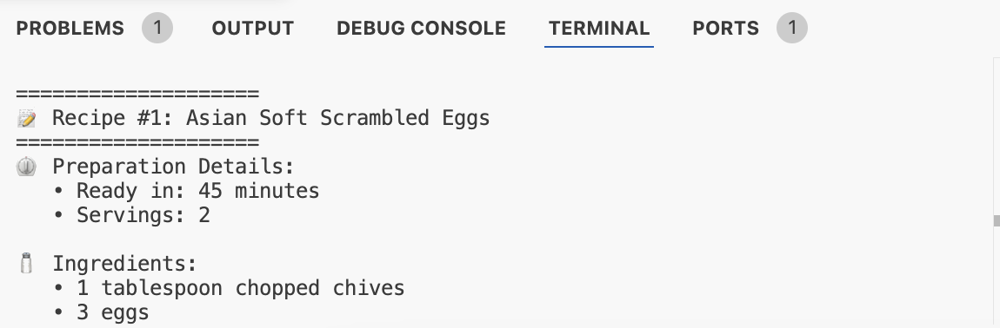

# Flavor Bot 🍳

Flavor Bot is an intelligent recipe recommendation chatbot that suggests recipes based on ingredients or dish preferences. The bot uses the Spoonacular API for recipe data, implements semantic search for better results, and leverages LLM capabilities for advanced query understanding and dietary restriction detection.

## Features and Live Demo
You can try out the live version of the Flavor Bot here: https://flavorbot.akgns.com/

## Screenshots
### Web Interface


### Recipe Search Results


### CLI Interface


## Features
- Web UI for easy search
- CLI interface for command-line use
- Semantic search using transformer models
- LLM-powered query understanding (Groq/Ollama)
    - Natural language query interpretation
    - Automatic dietary restriction detection
    - Ingredient exclusion from natural language
    - Food relevance validation
- Advanced guardrails and validation
    - Input validation and sanitization
    - Prompt injection protection
    - Rate limiting for LLM calls
    - Output validation
- Rate limiting to prevent API abuse
- Detailed recipe information including:
    - Time
    - Servings
    - Ingredients list
    - Instructions
    - Source URL
- Comprehensive logging system
- Modular code structure with separation of concerns

## Project Structure
```
flavor-bot/
├── src/                    # Source directory
│   ├── components/         # Application components
│   │   ├── api.py          # API interaction module
│   │   ├── app.py          # Main application (Flask + CLI)
│   │   ├── llm.py          # LLM integration (Groq/Ollama) with guardrails
│   │   └── templates/      # HTML templates
│   └── logger.py           # Logging configuration
├── logs/                   # Log files directory
├── docker/                 # Docker configuration
│   └── Dockerfile          # Docker image definition
├── assets/                 # Images and assets
├── main.py                 # Application entry point
├── requirements.txt        # Dependencies
├── setup.py                # Package setup
└── README.md               # Documentation
```

## Setup

1. Clone the repository:
```bash
git clone https://github.com/ckakgun/flavor-bot.git
cd flavor-bot
```

2. Create a virtual env and activate it:
```bash
python -m venv .venv
source .venv/bin/activate  # On Windows: .venv\Scripts\activate
```

3. Install required packages:
```bash
pip install -r requirements.txt
```

4. Create a `.env` file in the project root and add your API keys:
```
API_KEY=your_spoonacular_api_key_here
LLM_PROVIDER=groq
GROQ_API_KEY=your_groq_api_key_here
```

**LLM Configuration (Optional):**
- Set `LLM_PROVIDER` to `groq` or `ollama` to enable LLM features
- For Groq: Get your API key from https://console.groq.com/
- For Ollama: Install Ollama locally (https://ollama.ai/) and set `LLM_PROVIDER=ollama`
- If not configured, the app will work without LLM features

## Usage

### Web Interface (Default)
Run the application:
```bash
python main.py
```
Then open your browser and navigate to http://localhost:5001

### CLI Interface
Run the application with the CLI flag:
```bash
python main.py --cli
```

### Docker Deployment
1. Build the Docker image:
```bash
docker build -t flavor-bot:latest -f docker/Dockerfile .
```

2. Run the Docker container:
```bash
docker run -p 5000:5001 \
  -e API_KEY=your_spoonacular_api_key_here \
  -e LLM_PROVIDER=groq \
  -e GROQ_API_KEY=your_groq_api_key_here \
  -it flavor-bot
```

3. Access the application at http://localhost:5000

### Example Queries
- "Show me some pasta recipes"
- "Vegetarian dinner ideas"
- "What can I cook with potatoes and cheese?"
- "Quick dinner recipes under 30 minutes"
- "Italian pasta dishes"
- "I'm allergic to nuts, show me dessert recipes"
- "Gluten-free breakfast without dairy"
- "Vegan protein-rich meals"

## Rate Limiting
The application includes comprehensive rate limiting to prevent excessive API usage:

**API Rate Limits:**
- Maximum 5 requests per 5 seconds per IP address (Local rate limiting)
- Maximum 150 requests per day (Spoonacular API limit)
- When the daily API limit is reached, users will be notified
- Applies to both web and CLI interfaces

**LLM Rate Limits:**
- Maximum 30 LLM calls per 60 seconds per IP address
- Input validation: 2-500 characters
- Prompt injection protection
- Automatic fallback if LLM is unavailable

> **Note**: The Spoonacular API has a daily limit of 150 requests with the free tier. Once this limit is reached, the application will notify users to try again the next day.

## Logging
The application includes a comprehensive logging system:
- Logs are stored in the `logs/` directory
- Each run creates a new log file with timestamp
- Logs include info, warning, and error messages
- Both console and file logging is enabled

## Dependencies
- Flask for web interface
- Sentence Transformers for semantic search
- Groq/Ollama for LLM-powered query understanding
- Requests for API calls
- Python-dotenv for environment variables
- PyTorch for tensor operations
- Numpy for numerical computations
- Hugging Face Hub for model management

## LLM Integration and Guardrails

The application includes advanced LLM integration with comprehensive safety measures:

**Supported Providers:**
- **Groq**: Fast LLM inference using Llama 3.1 8B Instant
- **Ollama**: Local LLM deployment for privacy and offline use

**Guardrail Features:**
- Input validation (length limits, type checking)
- Prompt injection detection and prevention
- Rate limiting per IP address
- Output validation and format checking
- Food domain filtering to ensure relevance
- Graceful degradation when LLM is unavailable

**LLM Capabilities:**
- Natural language query understanding
- Structured information extraction
- Dietary restriction and allergen detection
- Automatic ingredient exclusion
- Food relevance classification

## License
MIT License
